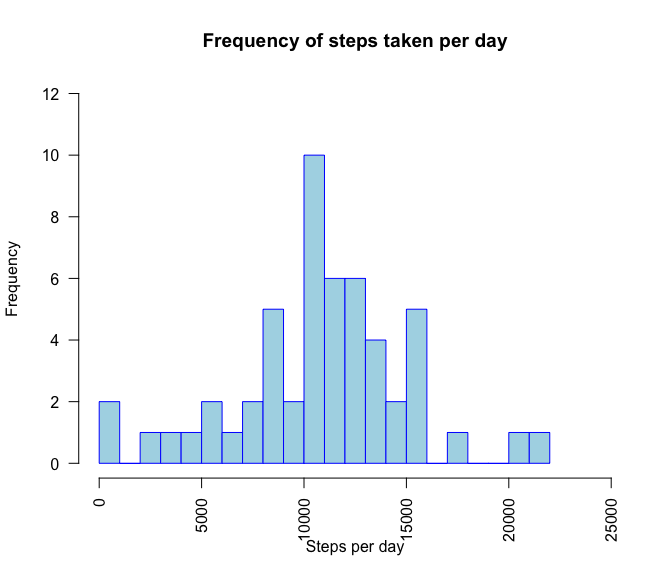
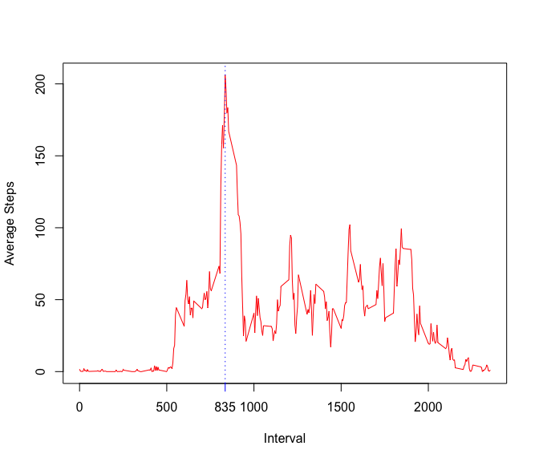
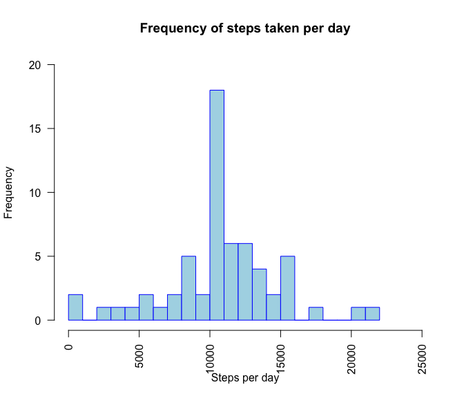
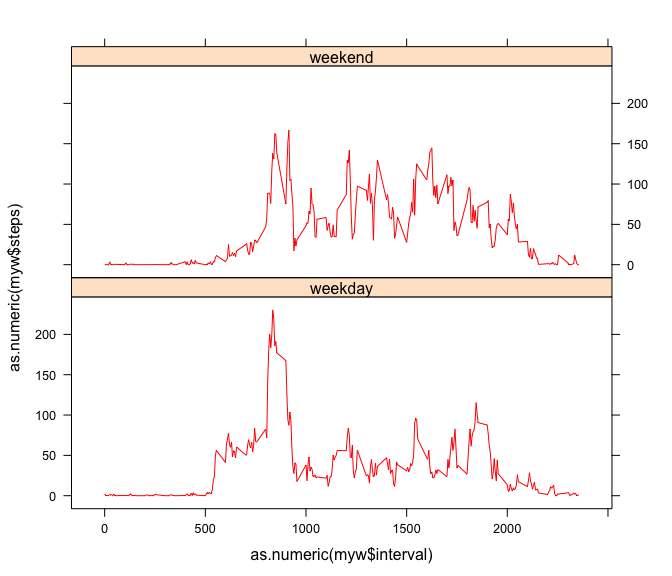

Reproducible Research Project Week 2
================

### Read "activity.csv"

``` r
setwd("/Users/joergheintz/Documents/08_MPHPHI/11_Coursera/Coursera_ReproduciableResearch/week2")
mydata<-read.csv("activity.csv", header = TRUE)
```

### Total number of steps, histogram, mean, and median

The data set contains NA, and can introducte bias.

##### Total number of steps taken per day

``` r
totSteps_I<-sum(mydata$steps, na.rm = TRUE)
totSteps_II<-sum(tapply(mydata$steps, mydata$date, sum, na.rm=TRUE))
```

The total number of steps taken by this persons within the month period were 570608 steps.

##### Histogram

The histogram illustrates the frequency of steps per day \[NA considered na.rm=FALSE\].

``` r
hist(tapply(mydata$steps, mydata$date, sum, na.rm=FALSE),
     main = "Frequency of steps taken per day",
     xlab = "Steps per day",
     ylab = "Frequency",
     breaks = 20,
     border = "blue",
     col="lightblue", 
     xlim=c(0,25000),
     ylim=c(0, 12),
     las=2)
```



##### Mean, Median of the total number of steps taken per day

The following table is based on the total number of steps = 570608 .

``` r
library(xtable)
StepsByDay<-tapply(mydata$steps , mydata$date, sum, na.rm=TRUE)
stepsMean<-round(mean(StepsByDay), 0)
stepsMedian<-median(StepsByDay)
totSteps_I<-sum(mydata$steps, na.rm = TRUE)
df<-data.frame()
df<-rbind(stepsMean, stepsMedian,totSteps_I)
df<-cbind(df, c(" mean per day ", " median per day ", " total all days "))
colnames(df)<-c(" Values ", " Description ")
xt <- xtable(df)
print(xt, type = 'html', include.rownames = FALSE)
```

<!-- html table generated in R 3.3.2 by xtable 1.8-2 package -->
<!-- Mon Mar 13 20:23:45 2017 -->
<table border="1">
<tr>
<th>
Values
</th>
<th>
Description
</th>
</tr>
<tr>
<td>
9354
</td>
<td>
mean per day
</td>
</tr>
<tr>
<td>
10395
</td>
<td>
median per day
</td>
</tr>
<tr>
<td>
570608
</td>
<td>
total all days
</td>
</tr>
</table>
Average daily activity pattern
==============================

``` r
library(data.table)
library(ggplot2)
StepsByInterval<-data.frame(tapply(mydata$steps, mydata$interval, mean, na.rm = TRUE))
StepsByInterval <-cbind(StepsByInterval, data.frame(rownames(StepsByInterval)))
colnames(StepsByInterval)<-c("steps", "interval")
x<-as.numeric(as.character(StepsByInterval$interval))
y<-as.numeric(as.character(StepsByInterval$steps))
IntMax<-as.numeric(as.character(StepsByInterval[StepsByInterval$steps == max(StepsByInterval$steps), 2]))
plot(x,y,type="l", col = "red", xlab = "Interval", ylab = "Average Steps")
abline(v = IntMax, col = "blue", lty = "dotted")
#text((800), min(y), "number", pos=2)
axis(1, at=IntMax,labels=IntMax, col = "blue")
```



### Interval with max average steps

``` r
IntMax<-StepsByInterval[StepsByInterval$steps == max(StepsByInterval$steps), 2]
```

The 835 interval is the 5-minute interval, that contains on across all the days the maximum average number of steps.

Imputing missing values
-----------------------

#### Total number of rows with NAs

``` r
myNAdata<-sum(is.na(mydata))
```

2304 is the total number of NA in the data set.

#### Strategy for filling in missing values (NA's)

The missing values will filled with mean values of the corresponsing intervals.

#### New Data Set that is equal to the original dataset but with the missing data filled in

##### Histogram

The histogram illustrates the frequency of steps per day \[NA filled with step means per interval\].

``` r
hist(tapply(ManData$steps, ManData$date, sum, na.rm=FALSE),
     main = "Frequency of steps taken per day",
     xlab = "Steps per day",
     ylab = "Frequency",
     breaks = 20,
     border = "blue",
     col="lightblue", 
     xlim=c(0,25000),
     ylim=c(0, 20),
     las=2)
```



##### Mean, Median of the total number of steps taken per day

``` r
library(xtable)
StepsByDay<-tapply(ManData$steps , ManData$date, sum, na.rm=TRUE)
stepsMean<-round(mean(StepsByDay), 0)
stepsMedian<-median(StepsByDay)
totSteps_I<-sum(ManData$steps, na.rm = TRUE)
df<-data.frame()
df<-rbind(stepsMean, stepsMedian,totSteps_I)
df<-cbind(df, c(" mean per day ", " median per day ", " total all days "))
colnames(df)<-c(" Values ", " Description ")
xt <- xtable(df)
print(xt, type = 'html', include.rownames = FALSE)
```

<!-- html table generated in R 3.3.2 by xtable 1.8-2 package -->
<!-- Mon Mar 13 20:23:47 2017 -->
<table border="1">
<tr>
<th>
Values
</th>
<th>
Description
</th>
</tr>
<tr>
<td>
10766
</td>
<td>
mean per day
</td>
</tr>
<tr>
<td>
10762
</td>
<td>
median per day
</td>
</tr>
<tr>
<td>
656704
</td>
<td>
total all days
</td>
</tr>
</table>
By filling in the missing values the total number of steps increased from 570608 to 656704. Mean and median are now very close together. The mean is actually a bit greater that the median. The histrogram looks in its from very similar but increased in the center by about 8000 steps per day.

Differences in activity patterns between weekdays and weekends
--------------------------------------------------------------

``` r
library(lattice)
# convert dates into the date-format 
mydata$date <- as.Date(mydata$date ,format="%Y-%m-%d")
# generate a dataframe with weekday names 
mydata$day<-weekdays(mydata$date)
# distinguish between weekday and weekend
daycat<-lapply(mydata$day, function(x) {
        if (x == "Saturday" | x == "Sunday")
                {
                x = "Weekend"}
        else {x = "Weekday"}
}
)
wewd<-data.frame(t(as.data.frame(daycat)))
colnames(wewd)<-"weekday-weekend"
mydata$wd_we<-wewd$`weekday-weekend`

## prep panel plots 
# steps weekend
StepsWeekend<-data.frame(tapply(mydata[mydata$wd_we=="Weekend", ]$steps, mydata[mydata$wd_we=="Weekend", ]$interval, mean))
StepsWeekend<-cbind(data.frame(rownames(StepsWeekend)), StepsWeekend)
colnames(StepsWeekend)<-c("interval", "steps")

#steps weekdays
StepsWeekdays<-data.frame(tapply(mydata[mydata$wd_we=="Weekday", ]$steps, mydata[mydata$wd_we=="Weekday", ]$interval, mean))
StepsWeekdays<-cbind(data.frame(rownames(StepsWeekdays)), StepsWeekdays)
colnames(StepsWeekdays)<-c("interval", "steps")

library(lattice)
df<-data.frame(tapply(mydata$steps, list(mydata$interval, mydata$wd_we), mean))
df$interval <- rownames(df)

wd<-data.frame(df[,c(3,1)])
wd$cat<-"weekday"
colnames(wd)<-c("interval", "steps", "wd_we")
we<-data.frame(df[,c(3,2)])
we$cat<-"weekend"
colnames(we)<-c("interval", "steps", "wd_we")

myw<-rbind(wd,we)
xyplot(as.numeric(myw$steps) ~ as.numeric(myw$interval)| as.factor(myw$wd_we), layout = c(1,2), col = "red", type = "l")
```


